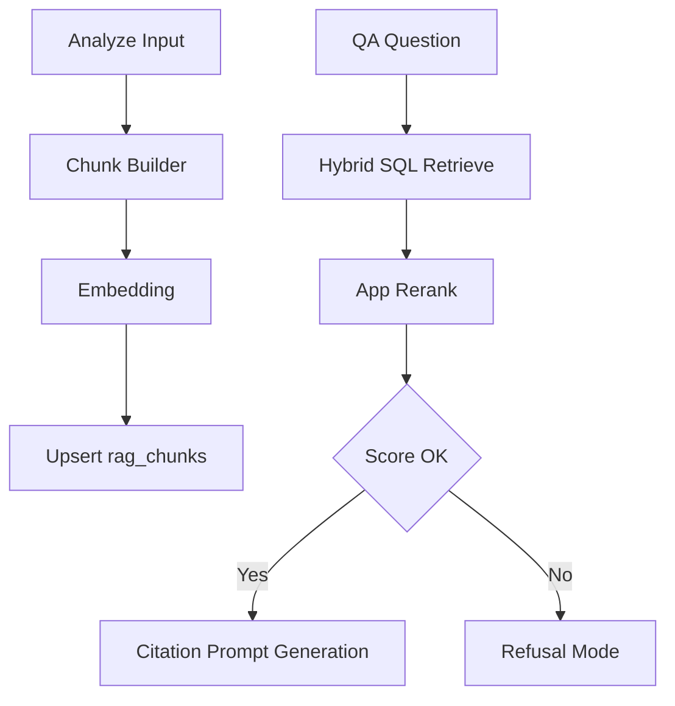

# RAGFlow → Copyvara RAG 엔진 이식 설계안 (1차: 기본 RAG)

범위 고정:
- 포함: ingestion, chunking, hybrid retrieval, rerank, citation generation
- 제외: GraphRAG, agent, memory, 서버/배포 인프라

근거 소스:
- RAGFlow 핵심 검색/재랭크: `rag/nlp/search.py`, `rag/nlp/query.py`, `rag/llm/rerank_model.py`
- RAGFlow 청킹: `rag/nlp/__init__.py`, `rag/flow/splitter/splitter.py`, `rag/app/naive.py`
- RAGFlow 인용 규칙: `rag/prompts/citation_prompt.md`
- Copyvara 대상: `supabase/functions/analyze/index.ts`, `supabase/functions/qa/index.ts`, `supabase/sql/pgvector_setup.sql`

---

## STEP 1) RAGFlow 코드 분석

## 1-1. 폴더 구조 요약

### RAG 엔진 관련(유지 검토)
- `rag/`
  - `rag/app/` 문서 유형별 파서 + 청킹 진입점
  - `rag/nlp/` 토크나이징, hybrid similarity, retrieval/rerank 핵심
  - `rag/flow/` parser/splitter 파이프라인 컴포넌트
  - `rag/llm/` embedding/rerank 모델 어댑터
  - `rag/prompts/` citation 등 생성 프롬프트

### 제외 대상(1차 이식 비범위)
- 서버/API: `api/`, `admin/server/`, `mcp/`
- 배포/인프라: `docker/`, `helm/`, `Dockerfile*`, `conf/*(es/infinity 중심)`
- UI: `web/`, `docs/`, `example/`
- 고급 기능: `rag/graphrag/`, `agent/`, `memory/`, `rag/advanced_rag/`

## 1-2. 핵심 책임 매핑

- ingestion
  - RAGFlow: 문서 파싱 + 구조화 입력은 `rag/app/naive.py`, `rag/flow/parser/parser.py`
  - 핵심 개념: 다양한 source를 텍스트 sections로 정규화 후 downstream 청킹 전달

- chunking
  - RAGFlow: `naive_merge`, `naive_merge_with_images`, `tokenize_chunks` 계열
  - 핵심 개념: token budget 기반 병합 + overlap + child delimiter split + 위치 메타

- retrieval
  - RAGFlow: `Dealer.search`에서 텍스트 질의 + dense 질의 + fusion
  - 핵심 개념: lexical + vector hybrid, 빈결과시 완화 재시도

- ranking
  - RAGFlow: `Dealer.rerank`, `Dealer.rerank_by_model`, `FulltextQueryer.hybrid_similarity`
  - 핵심 개념: token similarity + vector similarity 가중합, optional model rerank

- generation
  - RAGFlow: citation 규칙 프롬프트 + 답변 후 인용 정합
  - 핵심 개념: 근거 문장 단위 인용, 근거 없는 단정 억제

---

## STEP 2) Copyvara 매핑

## 2-1. 경로 매핑

- ingestion → `supabase/functions/analyze/index.ts`
  - 현재 `persistRagChunks`가 summary/bullet/segment 저장
  - 여기에 RAGFlow식 chunk builder 추가

- retrieval → `supabase/functions/qa/index.ts`의 `retrieveContextDocs`
  - 현재 vector-only RPC(`match_rag_chunks`) 호출
  - hybrid RPC 호출로 교체

- generation → `supabase/functions/qa/index.ts`의 `callOpenAI`
  - citation 규칙 강화 + 거절 모드 분기 추가

## 2-2. 필요한 DB 메타필드

`rag_chunks.metadata` 확장:
- `chunk_kind`: summary | bullet | segment | body
- `token_count`: int
- `chunk_order`: int
- `source_type`: manual | chatgpt | gemini | claude
- `topic_tags`: text[] or jsonb array
- `doc_type`: text | conversation

추가 컬럼 권장:
- `content_tsv tsvector` (lexical 검색)
- `lexical_weight real default 1.0`

---

## STEP 3) Supabase 기준 재작성 설계

## 3-1. Edge Function 구조

- 신규 공유 모듈
  - `supabase/functions/_shared/rag/chunking.ts`
  - `supabase/functions/_shared/rag/retrieval.ts`
  - `supabase/functions/_shared/rag/rerank.ts`
  - `supabase/functions/_shared/rag/prompts.ts`
  - `supabase/functions/_shared/rag/degrade.ts`

- 기존 수정
  - `supabase/functions/analyze/index.ts`: 청킹/임베딩/업서트 파이프라인 강화
  - `supabase/functions/qa/index.ts`: hybrid retrieval + rerank + 거절/인용 생성

## 3-2. Hybrid 검색 SQL

신규 함수 `match_rag_chunks_hybrid`:
- 입력: owner_user_id, query_embedding, query_text, topk, weights
- 내부:
  - vector score: `1 - (embedding <=> query_vec)`
  - lexical score: `ts_rank_cd(content_tsv, websearch_to_tsquery('simple', query_text))`
  - normalized fusion: `w_vector * vector_norm + w_lexical * lexical_norm`
  - 1차 보수 기본값: `w_vector=0.82`, `w_lexical=0.18`
- 출력: score breakdown 포함

## 3-3. Reranking 단계

1) SQL hybrid topN(예: 24) 회수
2) 앱 레벨 가벼운 rerank
   - token overlap 점수
   - optional model rerank API 사용 가능 시 결합
3) 최종 topK(예: 6)

## 3-4. Threshold 기반 거절 모드

- 조건
  - `top1_score < answerable_threshold`
  - 또는 `top3_score_avg < weak_context_threshold`
  - 또는 `evidence_count < 2`
- 동작
  - 답변 대신 `INSUFFICIENT_CONTEXT` 코드와 보수적 안내문
  - hallucination 억제

권장 기본값:
- `answerable_threshold = 0.75`
- `weak_context_threshold = 0.66`
- `min_evidence_count = 2`

## 3-5. Citation 기반 generation 템플릿

- 컨텍스트 블록 형식: `[ID:n] title\nchunk`
- 시스템 규칙
  - 수치/날짜/인과/비교/전문정의/예측은 인용 강제
  - 문장 끝 인용 `[ID:n]`
  - 근거 외 내용 단정 금지

## 3-6. mock/fallback 제거 후 degrade 모드

- 기존 mock 응답 제거
- degrade 우선순위
  1) primary LLM 실패 시 fallback 모델 1회
  2) 그래도 실패 시 deterministic 안전 응답 + retrieval evidence만 반환
  3) retrieval 자체 실패 시 `RETRIEVAL_UNAVAILABLE` 명시

---

## Mermaid 워크플로



---

## STEP 4) 산출물

## 4-1. 유지할 RAGFlow 핵심 개념

1) token budget + overlap 기반 청킹
2) lexical + vector hybrid retrieval
3) retrieval 후 재랭킹
4) citation 강제형 생성 규칙
5) low confidence시 보수적 응답

## 4-2. 제거할 RAGFlow 파일군

- 서버/배포/UI/운영
  - `api/**`, `admin/**`, `docker/**`, `helm/**`, `web/**`, `docs/**`, `example/**`, `conf/**`
- 1차 비범위 기능
  - `rag/graphrag/**`, `rag/advanced_rag/**`, `agent/**`, `memory/**`

## 4-3. Copyvara에 추가할 파일 목록

- `supabase/functions/_shared/rag/chunking.ts`
- `supabase/functions/_shared/rag/retrieval.ts`
- `supabase/functions/_shared/rag/rerank.ts`
- `supabase/functions/_shared/rag/prompts.ts`
- `supabase/functions/_shared/rag/degrade.ts`
- `supabase/sql/rag_hybrid_search.sql`

## 4-4. 수정 파일 diff (적용용 초안)

```diff
diff --git a/supabase/functions/analyze/index.ts b/supabase/functions/analyze/index.ts
--- a/supabase/functions/analyze/index.ts
+++ b/supabase/functions/analyze/index.ts
@@
-const fallbackMock = ...
+import { buildRagChunks } from '../_shared/rag/chunking.ts';
+import { getDegradeAnalyzePayload } from '../_shared/rag/degrade.ts';
@@
-const persistRagChunks = async (...) => { ...summary/bullet/segment only... }
+const persistRagChunks = async (...) => {
+  const chunkInputs = buildRagChunks({ documentId, sourceType, data });
+  for (const chunk of chunkInputs) {
+    const embedding = await getEmbedding(chunk.content);
+    if (!embedding) continue;
+    await upsertChunk({ ...chunk, embedding, ownerUserId, workspaceId, documentId });
+  }
+}
@@
-if (!OPENAI_API_KEY) return { ok: true, content: fallbackMock(...)}
+if (!OPENAI_API_KEY) return getDegradeAnalyzePayload(input, sourceType, documentId, contextDocs)
```

```diff
diff --git a/supabase/functions/qa/index.ts b/supabase/functions/qa/index.ts
--- a/supabase/functions/qa/index.ts
+++ b/supabase/functions/qa/index.ts
@@
-const retrieveContextDocs = async (...) => match_rag_chunks(...)
+import { retrieveHybridDocs } from '../_shared/rag/retrieval.ts';
+import { rerankDocs } from '../_shared/rag/rerank.ts';
+import { buildCitationPrompt } from '../_shared/rag/prompts.ts';
+import { shouldRefuseAnswer, buildRefusalResponse } from '../_shared/rag/degrade.ts';
@@
+const retrieved = await retrieveHybridDocs({ ownerUserId, question, topk: 24 });
+const reranked = await rerankDocs({ question, docs: retrieved, topk: 6 });
+if (shouldRefuseAnswer(reranked)) {
+  return jsonResponse(200, buildRefusalResponse(requestId, startedAt));
+}
+const prompt = buildCitationPrompt({ question, docs: reranked });
```

```diff
diff --git a/supabase/sql/pgvector_setup.sql b/supabase/sql/pgvector_setup.sql
--- a/supabase/sql/pgvector_setup.sql
+++ b/supabase/sql/pgvector_setup.sql
@@
+alter table public.rag_chunks
+  add column if not exists content_tsv tsvector,
+  add column if not exists lexical_weight real not null default 1.0;
+
+create index if not exists rag_chunks_content_tsv_gin
+  on public.rag_chunks using gin(content_tsv);
+
+create or replace function public.rag_chunks_tsv_trigger()
+returns trigger language plpgsql as $$
+begin
+  new.content_tsv := to_tsvector('simple', coalesce(new.title,'') || ' ' || coalesce(new.content,''));
+  return new;
+end;
+$$;
+
+drop trigger if exists trg_rag_chunks_tsv on public.rag_chunks;
+create trigger trg_rag_chunks_tsv
+before insert or update of title, content
+on public.rag_chunks
+for each row execute function public.rag_chunks_tsv_trigger();
+
+create or replace function public.match_rag_chunks_hybrid(
+  p_owner_user_id uuid,
+  p_query_embedding float8[],
+  p_query_text text,
+  p_match_count int default 24,
+  p_vector_weight real default 0.82,
+  p_lexical_weight real default 0.18
+) returns table (
+  id text,
+  document_id text,
+  segment_id text,
+  title text,
+  content text,
+  vector_score float,
+  lexical_score float,
+  final_score float
+) language sql stable as $$
+with base as (
+  select
+    rc.id,
+    rc.document_id,
+    rc.segment_id,
+    rc.title,
+    rc.content,
+    (1 - (rc.embedding <=> ((p_query_embedding::text)::vector)))::float as vector_score,
+    ts_rank_cd(rc.content_tsv, websearch_to_tsquery('simple', coalesce(p_query_text,'')))::float as lexical_score
+  from public.rag_chunks rc
+  where rc.owner_user_id = p_owner_user_id
+), norm as (
+  select
+    *,
+    case when max(vector_score) over () > 0 then vector_score / nullif(max(vector_score) over (),0) else 0 end as v_norm,
+    case when max(lexical_score) over () > 0 then lexical_score / nullif(max(lexical_score) over (),0) else 0 end as l_norm
+  from base
+)
+select
+  id, document_id, segment_id, title, content,
+  vector_score, lexical_score,
+  (coalesce(p_vector_weight,0.82) * v_norm + coalesce(p_lexical_weight,0.18) * l_norm) as final_score
+from norm
+order by final_score desc
+limit greatest(coalesce(p_match_count,24),1);
+$$;
```

## 4-5. pgvector 스키마 변경안

- 유지: `embedding vector(1536)`, `ivfflat` 인덱스
- 추가: `content_tsv`, GIN 인덱스, tsv trigger
- 추가 함수: `match_rag_chunks_hybrid`

## 4-6. 단계별 마이그레이션 순서

1) SQL 변경 배포
2) `_shared/rag/*` 모듈 추가
3) `analyze` 청킹/저장 경로 교체
4) `qa` retrieval/rerank/citation/거절 모드 교체
5) 프런트는 기존 API shape 유지 확인
6) mock 응답 제거, degrade 응답 코드 문서화

## 4-7. 위험요소 및 성능 영향

- 위험
  - tsvector 미구성 시 lexical score 무효
  - rerank topN 과대 시 LLM/CPU 비용 증가
  - 임계치 과보수 시 answer rate 하락

- 성능
  - ivfflat + GIN 동시 사용으로 검색 품질↑, 쓰기 비용 소폭↑
  - 2-stage retrieval로 latency 증가 가능
  - topN / topK / threshold 튜닝 필요
